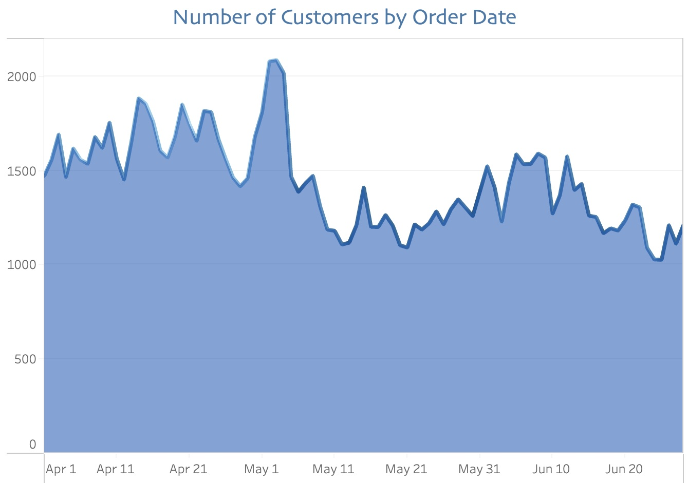
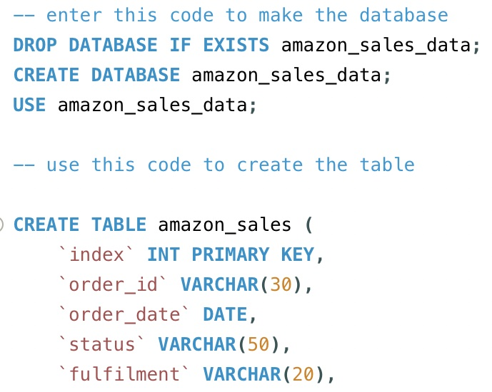
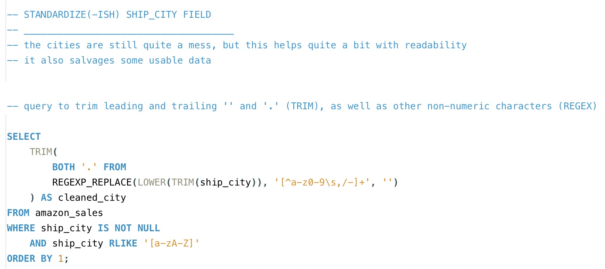
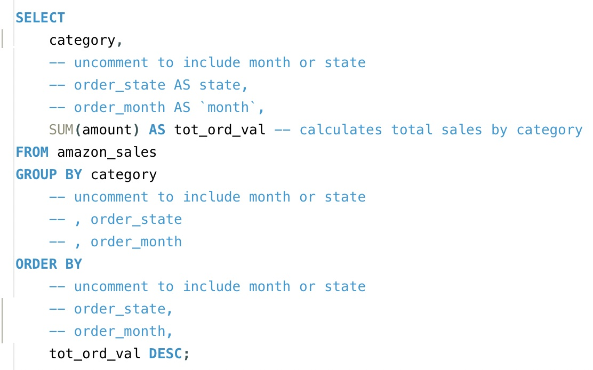
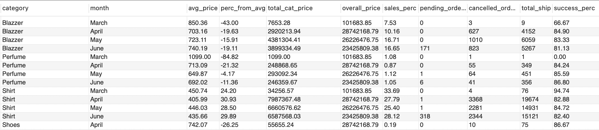
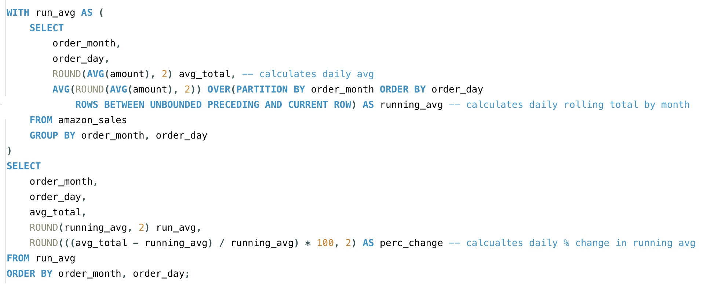
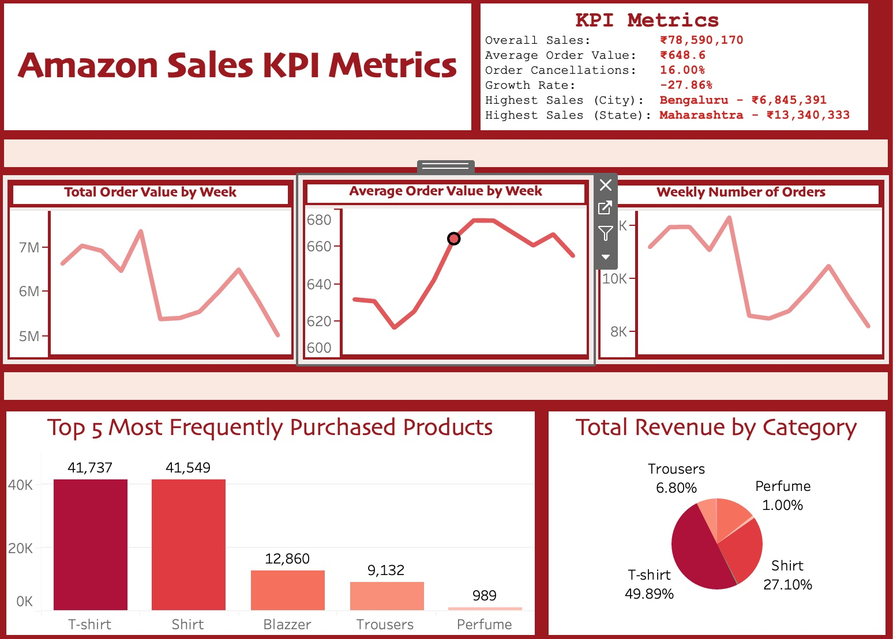
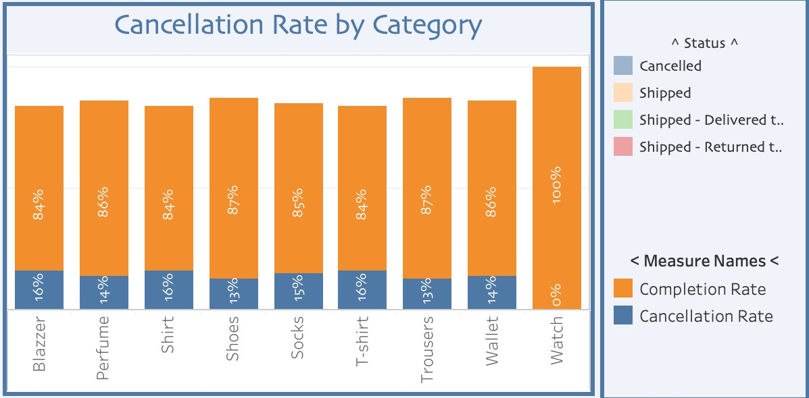

<h1 align="center" style="font-size: 2em;">
Prime Time: Unboxing Amazon Sales with SQL & Tableau
</h1>   

Amazon isn't just a retailer—it's a data machine. From order fulfillment to shipping success rates, the company leaves a breadcrumb trail of metrics. In this project, I rolled up my sleeves and dove into a simulated Amazon dataset to uncover the KPIs behind the clicks. Think of it as unpacking Prime, one SQL query at a time.

  

While the dataset itself is merely a generated simulation of Amazon sales data in India, the metrics and dynamics match those found in real-world reports. Using a variety of CTEs, window functions, aggregations, subqueries and joins, I manage to draw out the defining features of the data while also pinpointing the limitations to simulated data. After the analysis, Tableau was used to generate visualizations for the data. 

  

The data for this project was obtained from [this Kaggle dataset](https://www.kaggle.com/datasets/arpit2712/amazonsalesreport) and then cleaned, organized and indexed.

## Table of Contents

- [I. Included Files](#i-included-files)
- [II. Included Datasets](#ii-included-datasets)
- [III. Putting the Pieces Together](#iii-putting-the-pieces-together)
- [IV. Putting the Data to the Test (SQL)](#iv-putting-the-data-to-the-test-sql)
- [V. Dashboards and Discoveries (Tableau)](#v-dashboards-and-discoveries-tableau)
- [VI. Tools Used](#vi-tools-used)
- [VII. Conclusion](#vii-conclusion)
- [VIII. Contact Info](#viii-contact-info)
- [IX. Appendix: Sample Code](#ix-appendix-sample-code)
- 

## I. Included Files

- Amazon Dataset - Original (amazon_sales_report_cleaned.csv)
- Amazon Dataset - Cleaned (amazon_sales_report_OG.csv)
- Amazon Import SQL Script (amazon_sales_schema_setup.sql)
- Amazon Schema Diagram (amazon_sales_diagram.pdf)
- Amazon Data Wrangling (amazon_sales_data_wrangling.sql)
- Amazon Data Analysis Queries (amazon_sales_analysis.sql)
- Amazon Dashboards (amazon_sales_tableau_story.twb)

## II. Included Datasets

- amazon_sales_report_cleaned.csv

The dataset is available in its cleaned as well as original form. 

## III. Putting the Pieces Together

The file amazon_sales_schema_setup is a modifiable SQL code (amazon_sales_schema_setup.csv) allowing one to import the dataset directly into a SQL database. Throughout this project, I employed MySQL Workbench. 

  

Following this process, the data was then cleaned and organized. When necessary, data types were changed, some columns were added for functionality and certain fields required extensive alterations, most notably the city field (see image below). Full disclosure: I borrowed some REGEX logic from the wider web. While I’m still leveling up my REGEX game, this project gave me a chance to get my hands dirty with real cleaning logic—messy fields and all. The script for these changes is also included in the project (amazon_sales_data_wrangling.sql).

  

If all of this code is run, then you end up with the cleaned dataset that is readily available.

## IV. Putting the Data to the Test (SQL)

When the dataset was finally ready to work with, I got to work on extracting the information that would allow me to make informed decisions and educated estimates. In doing so, I worked to ensure the queries were modifiable to various needs, which further enabled me to focus on the results rather than repeating code for numerous fields.

  

The main areas of concern are listed as follows:

- KPI Analysis (general and monthly)
- Time Data Analysis
- Fulfillment and Shipping Analysis
- Category and Product Analysis
- Location Data Analysis
- Performance Analysis

My primary concern was being able to compile an SQL query that would break down KPIs into a usable format for business interests. I created two versions of this code, one of which is focused on the overall sales and another which breaks it down into monthly groupings. The calculations for this table included a number of fields: (a) average order value by category, (b) deviation from the overall monthly average order value (as a \%), (c) total monthly revenue by category, (d) total monthly revenue for all categories, (e) proportion of revenue comparative to overall sales, (f) number of pending orders, (g) number of cancelled orders, (h) total number of shipments and (i) shipment success rate by category (not cancelled, pending or returned). 

  

The more concentrated analysis is carried out from here on in the SQL script, which encases a wide variety of queries targeting fundamental areas of interest and deciphering less useful information (partially a feature of the generated data). Ultimately, my analyses centered around time, product and category performance, geographic insights and overall business efficiency. Many times, this required rather complex CTE integration into a final query, subqueries to filter out or target results and window functions to gain a more complex understanding of the information (especially regarding temporal metrics). 

  

While these findings were invaluable in many respects, the true magic comes through when the data is explored visually.

## V. Dashboards and Discoveries (Tableau)

For the visualizations, I have focused on compiling two concentrated and static dashboards, in contrast to my interactive dashboards for my [Zillow Project](https://github.com/AnalyticsByJake/sql_meets_suburbia). Interactive dashboards are great—but sometimes less is more. Here, I focused on static Tableau dashboards designed for clarity and quick impact. The goal: insights that speak for themselves, no clicks required. The dashboards can be found either as a Tableau Workbook (amazon_sales_tableau_story.twb) or on my [Tableau Public](https://public.tableau.com/app/profile/analyticsbyjake).

The first dashboard focuses on "Amazon Sales KPI Metrics," creating a general overview of business during the dataset's timespan. I've included core metrics such as overall sales or cancellation rate, time analyses of total order value, average order value and number of orders (by week) and finally visualizations comparing sales of products and categories. 

  

While the KPI dashboard may be quite interesting for general business performance, I then tried to take advantage of the wealth of data provided for customer demographics, shipment statuses and geolocation fields. This approach allowed me to focus on a different area, such as marketing, logistics or vendor relationships, to see what conclusions could be drawn out. 

  

In the end, I put together two highly targeted and informative dashboards to help decision-makers ensure their choices were not only informed but also practical, efficient and beneficial to the company's interests.

## VI. Tools Used

- MySQL Workbench
- Excel
- Tableau 

## Conclusion

Though the data itself was simply a generated dataset rather than real-world data, it gave me the opportunity to embrace a number of cleaning techniques, complex query formation, data extraction and visualization strategies. While there is a great deal of focus within the world of data analysis on being able to understand what information is valuable and what is not, it is just as important to be able to understand what to do with that information once you have it. Throughout this project, my goal was to accomplish both of these feats, providing not only useful metrics but also insightful deductions using both simple and complex logic. 

## VIII. Contact Info

[Linkedin](www.linkedin.com/in/jacob-maze-8a4a0772)

[Personal Website](https://analyticsbyjake.github.io/abj/)

[GitHub](https://github.com/AnalyticsByJake)

[Tableau Public](https://public.tableau.com/app/profile/analyticsbyjake)

[Academia.edu](https://aauni.academia.edu/JacobMaze)

## IX. Appendix: Sample Code

